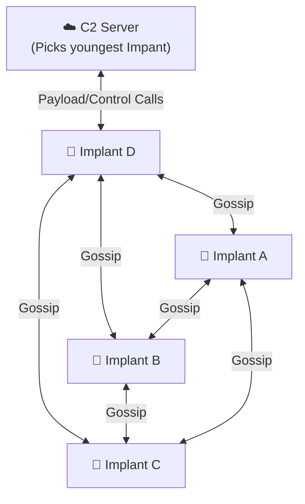

# Mesh C2 (PoC)


A proof‑of‑concept **hybrid‑decentralized** command‑and‑control mesh:

- 🤝 Peer‑to‑peer “gossip” network of implants
- ☁️ Central tracker C2 server (can die and ops continue)
- 🔄 Self‑healing: late‑joiners sync peers & pending tasks

---

## What’s Working

- Implants register & heartbeat to C2
- Commands sent to C2 → youngest implant → gossip‑propagated to all
- Peer‑list gossip ensures new implants catch up
- Results reported back to C2

## What’s Missing

- No encryption/authentication  
- No user management, metrics, etc.

---

## Quickstart

```bash
# 1. Run Install script
curl -fsSL https://raw.githubusercontent.com/pratiksingh94/mesh-c2/refs/heads/master/install.sh \
  | bash

# 2. Spin up the mesh and C2 (3 implants by default)
cd mesh-c2
./start.sh

# 3. (In a new terminal) tail logs
./attach-logs.sh
```

To spawn more implants or enable verbose mode:

```bash
./start.sh 5 -v    # 5 implants, verbose
```

To use the installer script with custom destination name:
```bash
bash -c "$(curl -fsSL https://raw.githubusercontent.com/pratiksingh94/mesh-c2/refs/heads/master/install.sh)" -- my-mesh-c2-dir

# it will install the project in my-mesh-c2-dir instead of mesh-c2 directory
```


---

## Send a Test Command

Go to `http://localhost:8000` (replace 8000 with whatever your C2 port is) and send it from there

---

## Architecture



---

## Components

| Directory        | Language | Role                                             |
| ---------------- | -------- | ------------------------------------------------ |
| `C2/`            | Python   | Flask server, SQLite persistence, REST API       |
| `implant/`       | C        | libcurl + cJSON “gossiping” agent                |
| `install.sh`     | Bash     | Clone, chmod, bootstrap `.env`, next‑steps guide |
| `start.sh`       | Bash     | Launch C2 + implants, clean shutdown             |
| `attach-logs.sh` | Bash     | TMUX‑based multi‑pane log viewer                 |

